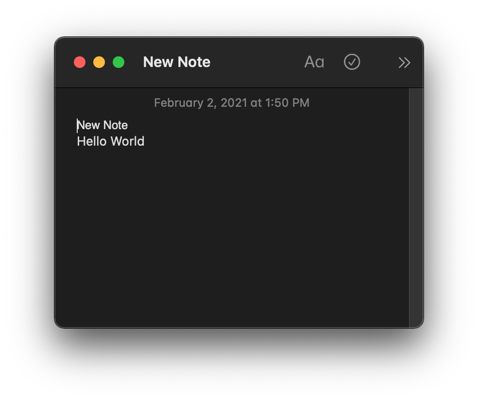
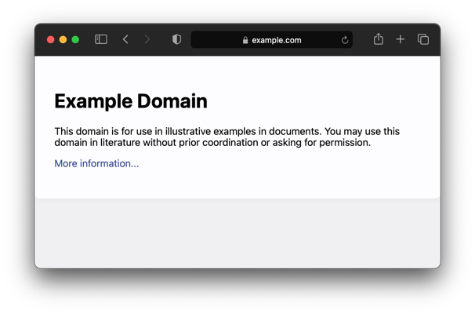

[](https://github.com/pose/automac/actions/workflows/main.yml)

# `automac` - Shell scripting for macOS applications

## Usage

```sh
automac <module> <command>
```

## Background

macOS offers many interactive applications such as the Notes and Safari apps.
Unfortunately, the way to interact with those apps programmatically is rather
limited and developers are forced to use [Applescript][applescript] or
[JXA][jxa]. These automation solutions are hard to debug, develop, and test:
There are multiple Stack Overflow posts pointing at JXA being fundamentally
[broken][jxa-broken], [undocumented][jxa-undocumented],
[unsupported][jxa-unsupported] and [cumbersome][jxa-cumbersome].

[applescript]: https://developer.apple.com/library/archive/documentation/AppleScript/Conceptual/AppleScriptLangGuide/introduction/ASLR_intro.html#//apple_ref/doc/uid/TP40000983
[jxa]: https://developer.apple.com/library/archive/releasenotes/InterapplicationCommunication/RN-JavaScriptForAutomation/Articles/Introduction.html#//apple_ref/doc/uid/TP40014508
[jxa-broken]: https://stackoverflow.com/a/48271686
[jxa-cumbersome]: https://stackoverflow.com/questions/57217151/how-to-get-multiple-properties-from-objects-in-jxa
[jxa-unsupported]: https://stackoverflow.com/questions/47940322/cant-find-jxa-documentation?rq=1#comment101622733_47940322
[jxa-undocumented]: https://stackoverflow.com/questions/62834881/overcome-the-lack-of-jxa-documentation-by-being-able-to-explore-the-variables-in

`automac` enables shell scripting for macOS applications by doing the JXA heavy
lifting and providing a simplified command line interface. Some of its features
are: composable standard input and output, an extendable modular system with
commands that do one (and only one) thing, and new-line separated JSON output by
default. In addition to that, the `automac` executable is self-contained and
doesn't have any dependencies given that it only requires JXA that is already
installed as part of every macOS installation.

## Examples

For instance, by sending the following command to the macOS Notes app:

```sh
$ echo "Hello world" | automac notes create "New Note"
{
  "pcls":"note",
  "body":"...",
  "id":"x-coredata://F123D456-1234-1234-1234-111111111111/ICNote/p1234",
  "name":"New Note",
  "plaintext":"New Note\nHello World "
  ...
}
```

It will produce the following new note with contents obtained from `stdin`:



Or by executing this command on Safari:

```sh
# Open new Safari tab pointing to example.com
$ automac safari open-tab https://example.com
{
  "url":"https://example.com/",
  "name":"Untitled",
  "index":13,
  "windowId":26971
}
```

It will result in the following tab to be created using the command line passed
URL:



These are some other available commands:

```sh
# List all Safari tabs
automac safari list-tabs

# List all Notes
automac notes list

# Retrieve a note by id from the Notes app
automac notes get-by-id x-coredata://F123D456-1234-1234-1234-111111111111/ICNote/p1234
```

For additional examples see the [samples](./samples) folder.

## Installation

```sh
autoreconf -fi
./configure
make && make check && make install
```

To uninstall:

```sh
make uninstall
```

## Testing

```sh
make check
```

Note: Testing triggers stateful interactions with macOS Applications. For
instance, Creating a note or deleting a note are not side effect free and an
end-to-end test require right permissions to be set.

## FAQs

## What versions of macOS are supported?

Currently, the project has been tested on Big Sur (11.0) and above versions but
there are no restrictions for previous macOS versions as long as they support
JXA.

## Does this module require any native component compilation?

No, everything is scripted and uses macOS `osascript` for executing commands.

## Why is the bundling done by concatenating JavaScript files instead of using a proper bundling solution such like Webpack?

This was done to keep the project simple and dependency free. Webpack could
definitely be added if required.

## Why does the project do not use TypeScript?

The project is simple and dependency free. TypeScript would add a dependency
and a build system.

## Are there any other similar tools available?

[Hammerspoon](https://github.com/Hammerspoon/hammerspoon) provides a similar
bridge between macOS but using Lua instead to script automation.
